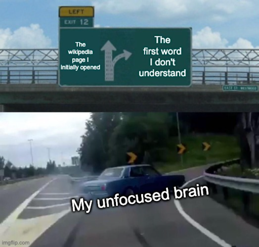

If you’ve ever dived into a wikipedia article, only to emerge 5 articles later with 10 facts unrelated to your search, you know that the digital labyrinth is full of gems and dead-ends. Your initial quest to understand the history of pizza might take you three articles down to the Spanish Wars of Succession as you learn about the House of Savoy and Princess Margarita, the eponym to the three ingredient classic. 

At times navigating wikipedia is a skillful hunt for the right fact, at others it’s a random stroll, gathering and picking the most insightful information. You might be of those who strategically dives through hyperlinks to a specific target seeking for a unique embedded fact, or you might aimlessly skim until a striking concept or unknown word changes your trajectory.
{: .text-justify}

Whether you search wikipedia the way you wander through a park, or are an experienced researcher with targeted goals, it remains that your answers are often scattered on multiple pages, with infinite paths tying them all together. So, if like us, you’re prone to clicking frenzies and falling down deep rabbit holes, you might be wondering if Wikipedia is responsible for any of your chaotic searches, and if it was really built for humans to intuitively navigate it…

While explaining why you ended up on this or that page is out of the scope of a naive datascientist’s capabilities, looking at West and Leskovec’s Wikispeedia game might shed some light on your odd behaviours. Wikispeedia, a game which tracks user paths from a source to a target article through a reduced Wikipedia dataset, can allow us to delve into strategies users can follow to go from one article to target information and whether they are effective, all the while studying how wikipedia’s architectural choices match user behaviour. More precisely, West and Leskovec note that humans tend to use "hub" nodes and leverage content cues to guide their navigation. Using this same game, we follow the digital breadcrumbs left by players on the Wikispeedia game and (1) rank their performance in order to assess (2) how their success is tied to the content of articles as well as (3) how the interconnections between articles determine the outcome of their attempts relative to category connections proposed by wikipedia.

## A digital treasure hunt on a miniature Wikipedia

In Wikispeedia players start from a source article, and have to reach a target article as fast as they can on a subset of wikipedia. The goal is to race as fast as possible from one article to the next to be the fastest at finding articles on Wikipedia! The paths players take are reported alongside whether or not they reached their target and the time they’ve taken to finish it. As you can see there are more finished paths than not, and trials where the paths were finished were less time-consuming on average.

{: .text-justify}

{: .text-center}
  
| Finished        | Count           | Average Time played  |
| ------------- |:-------------:| -----:|
| Unfinished      | 24874 | 835.25940 |
| Finished     | 51323      |   158.276199 |

      

The Wikispeedia game is composed of 4604 articles and their metadata from the original Wikipedia, including article categories, content and linking relations. The articles range from Alexander the Great to the United States and are layered inside of categories ranging from countries to famous people:


As players navigate from one article to another they visit articles organized under different categories arbitrarily created by wikipedia to group information and facilitate search. Interestingly, players do not systematically converge to articles on dominant categories! 
{: .text-justify} 



If source and target articles were distributed proportionally to their category dominance (which they are in Wikispeedia), you’d think that players converged to articles in more dominant categories, but here “geography” substantially dominates over “science” and categories like “people” did not even make it into the top 100 articles visited!

Who is the culprit for this dissonance? Is Wikipedia scheming to teach you about geography or do players simply have strategies that boycott looking up famous People? 

## Let us tell you about how you hunt for articles 
### Part 1- Article Preferences
If you were scrambling from one article to the next, would you head to the links at the top of the article or at the bottom? This is the first kind of question we want to ask to see if players have particular trends and strategies they follow. We look at article content features that could affect the way a player interacts with the content of an article:

* The ratio of input to output links
* The length of each article
* The position of links within the articles
* The level of the category 



Articles vary substantially in their length, tending linearly towards shorter lengths; it follows that there are more hyperlinks within the first thousand words from the top of articles. Moreover, articles tend to have more links going towards them than leaving them, hinting at unequal clustering across the network. 
But how about you, would you blindly click at the top of a page or strategically pick links embedded at the bottom? 



Here we observe that players that got to their target quicker tended to find links deeper in articles compared to players that took longer to finish their path. Similarly, players that completed their path and found their target also seemed to seek hyperlinks deeper in their articles. Patience pays in Wikispeedia!

We could also look at these differences for player’s tendencies to click on longer VS shorter articles or on articles with more or less output links, but given that these are purely naïve observations of potentially independent trends we will look at another way to evaluate each article’s interactions with players in a method later… 

First, let's look a little bit beyond individual articles and consider them as a network, the whole is always more than the sum of its parts after all! 

### Part 2: Network Preferences

Similarly, if article contents might affect how a player reaches his target, the network of articles itself will determine the path the player chooses to his target; to do so, the player can choose articles that have certain network characteristics.

Notably, we look at:

* Degree Centrality: a measure of the importance of a node in a network based on the number of connections (edges) it has.
* Betweenness Centrality: a measure of the extent to which a node lies on the shortest paths between other nodes in the network. Nodes with high betweenness centrality act as bridges or intermediaries in the network.
* Closeness Centrality: calculates how close a node is to all other nodes in the network on average. Nodes with higher closeness centrality are more central because they can reach other nodes more quickly.
* Eigenvector Centrality: assigns importance to a node based on its connections to other important nodes. Nodes connected to other nodes with high eigenvector centrality will also have high centrality scores.
* Clustering Coefficient: quantifies the likelihood that neighbors of a node are also connected to each other. High clustering coefficients indicate the presence of tightly knit communities or cliques in the network.

{: .text-justify} 



Centrality measurements seem to be skewed towards the lower end of their respective distributions showing that fewer nodes have high centrality measurements. However, we should note that the closeness centrality histogram appears to be more uniformly distributed showing a peak in the mid-range centrality values, thereon suggesting that nodes are on average equally distant from one another in the network. Similarly, clustering coefficients follow a slightly less skewed distribution, suggesting some level of tight-knit communities within the network. 

Do you think you would intuitively optimize for any of these measurements to reach your target? 

While evaluating whether a player optimized for any of these measurements out of his free will is beyond the scope of our narrow data oriented minds, we can look at whether or not players tended to choose paths that favored some of the network characteristics over another. 

Overall, the centrality distribution of all articles the players go through in the game is similar to the distribution of the distribution of all articles. 
However, we also see that the most frequented nodes (or hubs) by players have higher centrality values on average, as expected. That stands true whether the game is finished or not, though hubs in finished paths have slightly higher average centrality measures. It thus seems like the players are following some logical paths in the Wikipedia network and actively seek to find hubs.



What does this mean? 
Are players randomly picking nodes regardless of how central they are to their network? Or is wikipedia well optimized that players are following paths that match Wikipedia’s network?!

### Part 3 - Wikipedia Category Preferences

If we really want to see how wikipedia’s architecture might be influencing our players, it might be more interesting to look at whether Wikipedia’s category organization could have any influence on these network characteristics:



We look at the total number of categories (nodes) in each category as well as the number of connections between them (Edges)



We then look at density, a ratio of the number of connections in a category with regards to the number of possible connections in that category, as well as clustering (as previously explained).

When looking at within category centrality measurements, we see that the average degree is lower than the rest of our network’s, a reasonable finding given inter-category links are excluded. On the other hand, the density and clustering coefficients are mostly higher within each category. This suggests that articles within the same category are more interconnected compared to the overall Wikipedia link network.

In other words, given these measures, it sounds like it would hypothetically be easier for players to move from a source to a target within a category than between categories no? 

**But how do we verify all these interactions? How do we quantify their strength and what if they influence one another?**

## Finding information on wikipedia: a game of strategy, good architecture or mere luck?
### Part1 - What the articles say 

Simply observing player behavior on Wikispeedia has led to a few intriguing results so far, but we still have little insight on whether winners of Wikipedia are simply skilled at finding information, whether Wikipedia is simply well built for human wayfinding or if a player’s results are simply random.

Here we need to introduce regression models which will allow us to move beyond just describing patterns in data to actually understanding the relationships between different factors. Imagine you're a detective trying to figure out what influences the outcome of a case. You could simply observe and note down what you see, which is akin to the observational analysis we’ve done so far. However, if you want to get to the bottom of how different clues or factors interplay to affect the outcome, you need a more sophisticated approach—this is where regression models come into play.

In our case, we can investigate how various features of articles— their length, the position of links within them, or the ratio of their inbound to outbound links—affect how easily and quickly people navigate through them. A simple observational study might show you that longer articles tend to be harder to navigate, but is that the whole story? A regression model allows to see if there is more than one factor at play, it's like having the ability to hold certain factors steady while we look at the influence of others; in other words, we can see if the article length still makes navigation difficult when we control for the position of the links and the ratio of inbound/outbound links - an assessment which is more informative than simple observations, which can tell us what happened, but not necessarily why or what might happen in the future.

Furthermore, because we have two things we want to understand—whether people complete the navigation and how fast they do it—we build two separate models. This is like having two different lenses to examine our case: one to see if our clues lead to solving the case (completion), and another to see how fast we can get there (speed).



The way we determine the significance of our article features with regards to whether they affect the average duration of a run and its completion is through p-values - a low p-value (p < 0.05) means you should be surprised by your experiment because your results aren’t occurring by random chance!

At first glance the article’s length, its average input output link ratio and the position of hyperlinks within  them all seem to significantly affect both the average duration of player runs as well as whether or not the runs were completed (except for the average position in the case of completion where p = 0.764). However, for both of these models, we note very low r-squared values (0.002 for feature effects on completion and 0.001 for feature effects on average duration of a run), a statistical measure of how much variance can be explained by the features we are evaluating; in other words, our first test is rather inconclusive… 

The lengths, position of hyperlinks and ratio of input/output links of articles chosen are not very useful in explaining why a player is good and efficient at playing Wikispeedia.

But perhaps the centrality of the articles they gravitate towards will tell us something interesting about their Wikispeedia skills? 

### Part2 - What the network says
We carry out a similar model looking at whether or not having more of one type of hub centrality in one’s path affects a player’s run time for completed paths only. We take the ratio of hubs in a path to the number of articles in a path as a variable here. We use a ratio because if a player finishes his path quicker and consistently uses degree centrality as his strategy, then he might consistently have much fewer hubs than other players; counting hubs here would not be very fair to players with better strategies! 



Here we look at individual interactions of hub centralities with whether or not players finished and control for path lengths. With all p-values lower than 0.001, all our interactions are significant, and we notice that optimizing for closeness gives the highest chance of completing one’s path.

### Part3 - The player's fault or Wikipeedia's ?

We look at how existing categories may affect players’ performance. The categories indeed reflect some of the same thinking by players, as it significantly affects players’ performance. We notice a 7% increase in the chance of completion when the source and target articles are in the same category. Furthermore, players rate the game as less difficult (0.2 points on average on a 1-to-5 scale) and complete the game in a shorter time (~35 sec on average) when the target is in the same category as the source.

